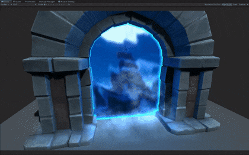
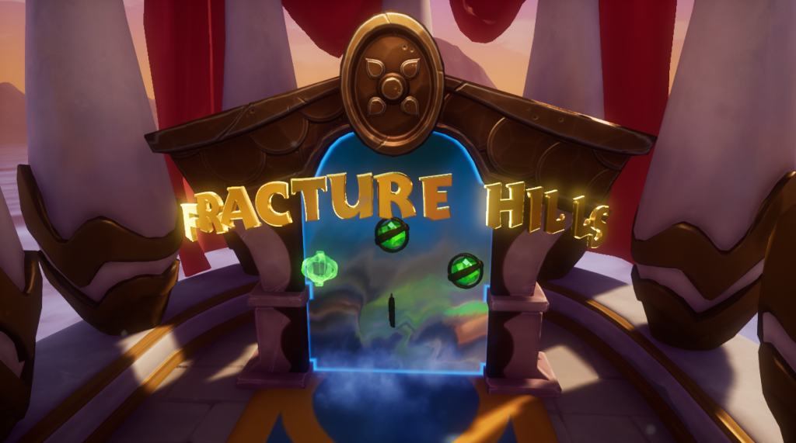

<h1 align="center"> Spyro The Dragon Inspired Portal Shader </h1>

|Custom Shader Version | Original Spyro: Reignited Trilogy Version |
|-|-|
| | |

    While playing Spyro: Reignited Trilogy, I have discovered the beautiful portals found in the game; they caught my attention at first sight.. you could say it was love at first sight. I soon started trying to re-create the portal in Unity using the techniques and knowledge I've gained at University and I was able to come up with this portal shader.

---

    This is my first shaders portfolio piece I have created after graduating in computer games programming; it took me a quite long time to get the shader working the way I wanted it to, and I've blogged my findings/research over at my blog. Here are the links to all blog posts about this shader:

<h3 align="center">
    A Look at Spyro: Reignited Trilogy's Portals
</h3>

1. **Rendering The Background** - [*blog post*](https://www.danielpokladek.me/a-look-at-spyros-portals-rendering-the-background/) - this first part describes my few attempts at creating and rendering the portal background as close as possible to the original.

2. **Distorting the Background** - [*blog post*](https://www.danielpokladek.me/a-look-at-spyros-portals-distorting-the-background/) - this second part describes how I achieved the background distortion and waves ~~ effect on the background.

3. **Outline Effect, Extra Stuff & Fixes** - [*blog post*](https://www.danielpokladek.me/a-look-at-spyros-portals-outline-effect-extra-stuff-fixes/) - this third, and final part, describes how I created the outline effect as seen in the games, some extra stuff like particle effects and I fix some bugs in this post too.

---

    Feel free to download, play around and learn from this shader repo; it definitely needs some improvement, but currently I'm focusing on learning more about shaders, so I'm hoping to come back to this one at some point and improve it. If you're going to use this in a project, you don't have to credit me but it would be very much appreciated if you do.

---

[< Back to Shader Main Page](https://github.com/danielpokladek/personal-shaders-repo)